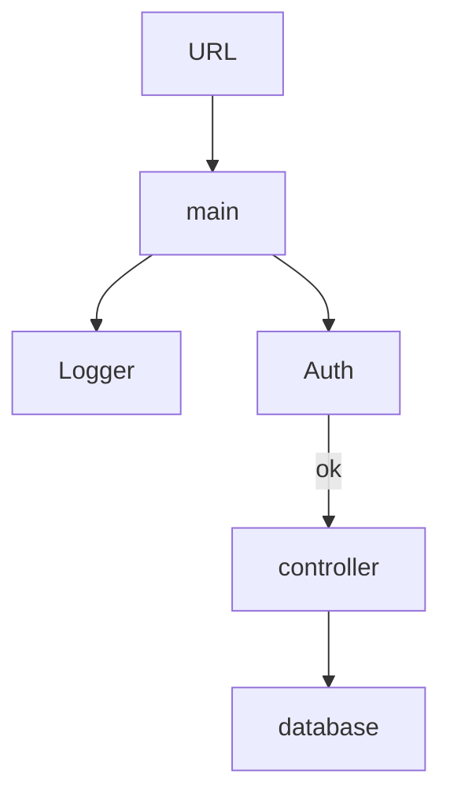

# Todo server

## Total Design

A TodoList with redis.




## Supported

- [x] Register

  ```sh
  curl -d '{"id": "ferriem", "password": "123"}' 127.0.0.1:8080/register
  ```

- [x] Add
  ```sh
  curl -d '{"id": "ferriem", "password": "123", "title": "exam", "description": "math"}' 127.0.0.1:8080/user/add
  ```

  

- [x] Delete
  ```
  curl -d '{"id": "ferriem", "password": "123", "title": "exam", "description": "math"}' 127.0.0.1:8080/user/delete
  ```

  

- [x] Done

  ```sh
  curl -d '{"id": "ferriem", "password": "123", "title": "exam", "description": "math"}' 127.0.0.1:8080/user/done
  ```

- [ ] Update

- [ ] HTML

- [ ] Cookie

- [ ] JWT

## Detail Design

### Framework

- **All** request comes to 127.0.0.1:8080 will be log in Redis list `logrus`, the log message can be modified in `logger.go`.

- **All** request comes to group 127.0.0.1:8080/user should be authenticated with `username` and `password`. *(Additional use Cookie to persist the log information)*

- The user todo_list in store in Redis list `username_list`, and the done information is stored both in the list and hash `username_title_description`.

### Register

Store the username with crypted password, hash name `username`, hashkey `username`,hashvalue `crypted password`.

### Login

Check whether the user is registered, then compare the password with crypted password.

### Add

Check whether the task exist. (Hash the task with "done": "false"), then push the task into the user todo list.

### Done

Set the task with "done": "true".

### Delete

Remove task from the list and delete the task hash.

